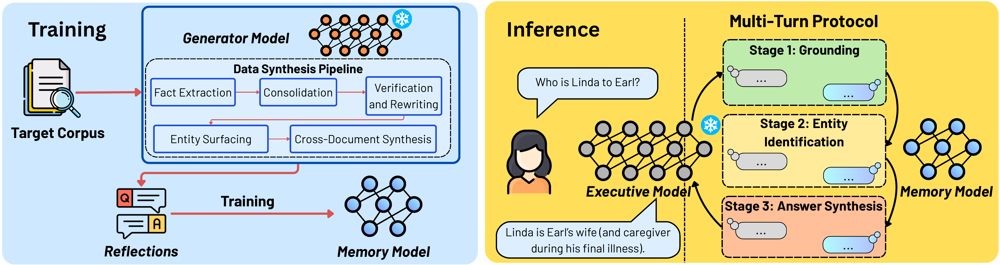

<div align="center">


# M<small>E</small>M<small>O</small>: Memory as a Model

### *Plug new knowledge into any LLM without retraining, retrieval pipelines, or touching its weights.*

<p>
  <a href="https://arxiv.org/abs/2605.15156"></a>
  <a href="https://arunv3rma.github.io/blogs/memo/"></a>
  <a href="https://huggingface.co/collections/Glow-AI/memo-memory-as-a-model"></a>
  
</p>

</div>

---

## TL;DR

> **MeMo** encodes new knowledge into a small, dedicated **M<small>EMORY</small>** model that any frozen LLM (open or closed-source) can query at inference time through a structured multi-turn protocol. You get cross-document reasoning, robustness to retrieval noise, zero catastrophic forgetting, and an inference cost that is **independent of corpus size**.

<p align="center">
  
  <br/>
  <em>Training (left): a frozen <b>G<small>ENERATOR</small></b> model transforms the corpus into a reflection question-answer (QA) dataset used to SFT the <b>M<small>EMORY</small></b> model. Inference (right): the <b>E<small>XECUTIVE</small></b> model decomposes the user query into sub-queries and reasons over M<small>EMORY</small> model's responses through a three-stage protocol.</em>
</p>

---

## Why MeMo?

LLMs are **frozen** after pretraining, yet the world keeps changing. Every existing method hits a wall:

- **RAG** is brittle to retrieval noise and struggles with cross-document reasoning.
- **Fine-tuning** is expensive and causes catastrophic forgetting.
- **Latent memory** is tightly coupled to the model that produced it.

MeMo is a modular framework that satisfies the following desirable properties simultaneously:

| Method | Frozen base LLM | No retrieval index | Black-box compatible | No catastrophic forgetting | Constant-size memory | Cross-LLM transferable |
| :--- | :---: | :---: | :---: | :---: | :---: | :---: |
| Non-parametric *(RAG, ICL)* | ✓ | ✗ | ✓ | ✓ | ✗ | ✓ |
| Parametric *(CPT, SFT)* | ✗ | ✓ | ✗ | ✗ | ✓ | ✗ |
| Latent memory *(AutoCompressor, Gist, ICAE)* | ✓ | ✓ | ✗ | ✓ | ✗ | ✗ |
| **MeMo (Ours)** | **✓** | **✓** | **✓** | **✓** | **✓** | **✓** |

---

## How It Works

MeMo splits **knowledge** from **reasoning** across two cooperating models:

- **Executive Model (EM)**: a frozen, capable LLM (open *or* closed-source). Decomposes complex queries into atomic sub-questions and synthesizes the final answer.
- **Memory Model (MEM)**: a compact 1.5B–14B model whose *parameters* encode the target corpus. Answers EM's sub-queries from internalised *reflections*, never seeing source documents at inference.

```
              OFFLINE TRAINING                        INFERENCE TIME
 ┌──────────────────────────────────────┐    ┌────────────────────────────┐
 │  Raw corpus                          │    │  User query                │
 │     │                                │    │     │                      │
 │     ▼                                │    │     ▼                      │
 │ 1.  Data synthesis  (5-step pipeline)│    │  Stage 1 - Grounding       │
 │     │                                │    │     │                      │
 │     ▼                                │    │     ▼                      │
 │ 2.  SFT training        (per corpus) │    │  Stage 2 - Entity ID       │
 │     │                                │    │     │                      │
 │     ▼                                │    │     ▼                      │
 │ 3.  Model merging  (optional, K -> 1)│    │  Stage 3 - Answer Synthesis│
 │     │                                │    │     │                      │
 │     ▼                                │    │     ▼                      │
 │ 4.  Evaluation                       │    │  Final answer              │
 └──────────────────────────────────────┘    └────────────────────────────┘
```

---

## Headline Results

Accuracy (%) on three knowledge-intensive benchmarks, reported as **Qwen2.5-32B-Instruct / Gemini-3-Flash** Executive models and **Qwen2.5-14B-Instruct** Memory model.

| Method | BrowseComp-Plus | NarrativeQA | MuSiQue |
| :--- | :---: | :---: | :---: |
| *Perfect Retrieval (oracle)* | *79.67 / 88.33* | *51.42 / 60.41* | *62.83 / 73.00* |
| BM25 | 1.11 / 27.00 | 10.24 / 14.33 | 20.00 / 23.20 |
| NV-Embed-V2 | 50.67 / 57.00 | 20.59 / 26.62 | 37.47 / 46.60 |
| HippoRAG2 | **56.11** / 66.33 | 21.39 / 23.21 | 42.17 / 57.00 |
| **MeMo (Ours)** | 54.22 / **66.67** | **26.85** / **53.58** | **48.30** / **60.20** |

**At a glance**

- 🎯  **Up to +27 pts on NarrativeQA** when MeMo is paired with Gemini-3-Flash, beating every retrieval baseline.
- 🛡️  **Robust to noise.** With 1× distractors added, NV-Embed-V2 and HippoRAG2 drop **up to 6.22%**, while MeMo *gains* 0.55% on BrowseComp-Plus.
- 🔌  **Plug-and-play.** Train MEM once with a 14B open model; swap in Gemini-3-Flash as EM at inference for up-to **27%** performance gain.
- ⚡  **5.5× compute savings** at K=10 corpora via model merging versus full retraining.
- 📦  **Constant inference cost** — MEM's parameters do not grow with the corpus.

---

## Repository Structure

```
MeMo/
├── baselines_icl/              # ICL oracle and closed-book baselines (bcp/, nqa/, msq/)
├── data_processing_utils/      # Download & preprocess raw datasets
├── data_synthesis_pipeline/    # 5-step synthetic reflection-QA generation
│   ├── data_subsets/           # Pre-generated subset IDs & hard-negative doc IDs
│   ├── datasynth_pipeline/     # End-to-end pipeline shell scripts per dataset
│   └── loo_data_ablation/      # Leave-one-out data ablation scripts
├── sft_training/               # SFT (full, LoRA, Gemma variants) with DeepSpeed ZeRO-2
├── model_merging_scripts/      # Parameter-space merging (Linear, SLERP, TIES, DARE)
├── evaluation_pipeline/        # MEMO eval (single-turn, unstructured, structured)
├── memo_requirements.txt
└── lfm_requirements.txt
```

---

## Benchmarks

| Dataset | Abbrev | Size | Task |
| :--- | :---: | :---: | :--- |
| BrowseComp-Plus | BCP | 300 questions | Long-context web document QA |
| NarrativeQA | NQA | 293 questions | Narrative document comprehension |
| MuSiQue | MSQ | 1 000 questions | Multi-hop reasoning across passages |

---

## Setup

### 1. Install dependencies

```bash
conda create -n memo python=3.10.19 -y
conda activate memo
pip install -r memo_requirements.txt

# Only needed as a separate env if training LFM memory models
conda create -n lfm python=3.10.20 -y
conda activate lfm
pip install -r lfm_requirements.txt
```

### 2. Environment variables

```bash
cp .env_sample .env
```

```ini
OPENAI_API_KEY=...        # Used by DeepEval for LLM-based scoring
OPENROUTER_API_KEY=...    # Optional: routing API calls
WANDB_API_KEY=...         # Optional: W&B experiment tracking
```

---

## Reproducing the Paper

The pipeline runs in four stages. Each links to a detailed sub-README.

### Stage 1 · Data Preparation
Download and preprocess the raw corpora.
→ See [`data_processing_utils/README.md`](data_processing_utils/README.md).

### Stage 2 · Data Synthesis
Generate the reflection-QA dataset with the 5-step pipeline (fact extraction → consolidation → verification → entity surfacing → cross-document synthesis). Each dataset has a self-contained shell script under [`data_synthesis_pipeline/datasynth_pipeline/`](data_synthesis_pipeline/datasynth_pipeline/). The pipeline can be parallelised across multiple vLLM servers — a sample launcher is provided at `vllm_serve_qwen2_5_32b_instruct.sh`.

> **Tip:** pre-generated subset IDs and hard-negative document IDs used in the paper are in [`data_synthesis_pipeline/data_subsets/`](data_synthesis_pipeline/data_subsets/) and can be fed directly into the synthesis or evaluation scripts. Larger pre-generated artifacts are mirrored on HuggingFace.

→ See [`data_synthesis_pipeline/README.md`](data_synthesis_pipeline/README.md).

### Stage 3 · SFT Training
Fine-tune one MEM checkpoint per corpus. Supports full SFT and LoRA across Qwen2.5, Gemma3, and LFM bases, with DeepSpeed ZeRO-2.
→ See [`sft_training/`](sft_training/).

### Stage 4 · Model Merging *(optional)*
Merge corpus-specific MEM checkpoints into a single generalist MEM via Linear, SLERP, Task Vectors, TIES, DARE-Linear, or DARE-TIES.
→ See [`model_merging_scripts/README.md`](model_merging_scripts/README.md).

### Stage 5 · Evaluation
All MEMO eval scripts launch two vLLM servers — one for EM, one for MEM — and support four paradigms:

| Paradigm | Directory | Description |
| :--- | :--- | :--- |
| Single-turn baseline | [`single_turn_baseline/`](evaluation_pipeline/single_turn_baseline/) | EM only, no MEM |
| Unstructured multi-turn | [`unstructured_multi_turn_baseline/`](evaluation_pipeline/unstructured_multi_turn_baseline/) | Naive multi-turn loop |
| **Structured multi-turn** | [`structured_multi_turn/`](evaluation_pipeline/structured_multi_turn/) | **Full MEMO protocol** |
| ICL baselines | [`baselines_icl/`](baselines_icl/) | Oracle retrieval and closed-book (no MEM) |

→ See [`evaluation_pipeline/README.md`](evaluation_pipeline/README.md) and each `baselines_icl/<dataset>/README.md` for script-level details.

---

## Citation

If MeMo is useful in your research, please cite:

```bibtex
@article{quek2026memo,
  title   = {MeMo: Memory as a Model},
  author  = {Quek, Ryan Wei Heng and Lee, Sanghyuk and
             Leong, Alfred Wei Lun and Verma, Arun and
             Prakash, Alok and Chen, Nancy F. and
             Low, Bryan Kian Hsiang and Rus, Daniela and
             Solar-Lezama, Armando},
  journal = {arXiv preprint arXiv:2605.15156},
  year    = {2026}
}
```

---


